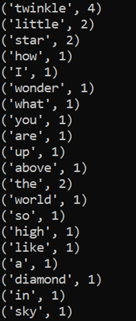

# Word_Count

- se trouver dans le bon répertoire de travail dans le terminal ( exemple: spark/bin)

- taper les commandes suivantes pour lancer le code : spark-submit Word_Count.py

- les résultats sont dans le dossier Resultat.txt, en particuler dans le fichier part-00000.txt
